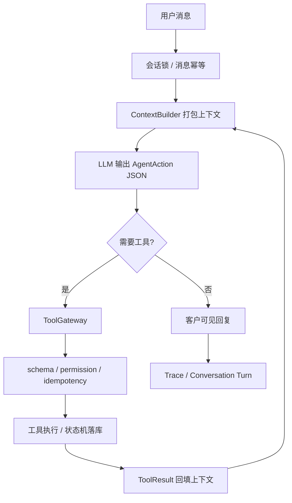

# Mahjong Ops Runtime

面向麻将馆组局运营的自主 Agent Runtime。

这个项目的当前主链路已经收敛为一个单独系统：`mahjong_agent_runtime`。旧 trial/workflow 和历史 v2 代码只作为业务参考、legacy eval 和迁移对照保留，不作为默认入口继续开发。

## 目标

让 LLM 像麻将馆运营助手一样理解用户消息、判断当前目标、决定是否查局池、找候选人、建局、生成待审批草稿、记录候选人反馈或转人工；后端只做生产边界，不替模型写麻将语义 if-else。

主链路原则：

- LLM 负责理解用户、判断目标、决定调用哪些工具和调用顺序。
- 后端负责工具 schema 校验、权限、幂等、状态机、并发、预算、日志和审计。
- 不允许旧 parser、旧 workflow、旧 guard 参与当前主链路。
- 不用后端业务 if-else 修复“通宵、人齐开、0。5、组、可以”等自然语言 badcase。
- 每一次模型输入、模型输出、工具调用、工具结果、状态变化都写入 trace。
- 回复不对进入 eval/badcase，不直接把单句坏例子硬编码进主流程。

## 当前入口

本地启动：

```bash
set -a
source .env
set +a
python scripts/run_agent_app.py
```

默认地址：

```text
http://127.0.0.1:8790/
```

确认当前服务：

```bash
curl http://127.0.0.1:8790/api/runtime
```

返回中应看到：

```json
{
  "runtime": "mahjong_agent_runtime",
  "main_chain": "agent_runtime",
  "implementation_package": "mahjong_agent_runtime"
}
```

主实现目录：

```text
src/mahjong_agent_runtime/
```

主文档：

```text
docs/agent_runtime.md
```

## 架构



## 可用工具

- `search_current_games`：查询当前局池，只读。
- `search_customers`：按结构化条件查询候选客户，只读。
- `create_game`：创建待组局记录，不发送消息，不确认房间。
- `create_invite_drafts`：创建待审批候选人邀约草稿。
- `create_outbound_message_drafts`：创建通道无关的待审批外发草稿。
- `record_candidate_reply`：记录候选人反馈并推进受控状态。
- `update_game_status`：按状态机更新局状态。
- `record_badcase`：记录 badcase/eval 候选样本。
- `update_context_checkpoint`：由模型写入长期上下文 checkpoint。

## 生产边界

- 模型不能直接改数据库，只能提出 tool call。
- 工具参数必须通过 ToolGateway schema 校验。
- 工具权限按 `execution_mode` 和 `risk_level` 控制。
- 局状态迁移必须符合状态机。
- 同一会话串行处理，避免上下文乱序。
- 消息结果幂等键按 `conversation_id + sender_id + message_id` 派生。
- 工具幂等键按 `conversation_id + sender_id + source_message_id + tool name + canonical arguments` 派生。
- LLM 超时、预算拒绝、合同错误都会 fail closed，不执行工具副作用。
- 模型输出合同错误会先回喂模型修正；持续失败、超时、预算耗尽或达到最大步数才转人工。
- Trace 格式为 `traceId-time(yyyy-mm-dd hh:mm:ss)-loglevel: content`。

## 上下文和记忆

`ContextBuilder` 每轮只负责打包上下文，不解释麻将语义。上下文包含：

- 当前消息。
- 最近对话。
- 客户画像。
- 当前局池。
- 待审批外发草稿。
- 上一轮工具结果。
- 可用工具 schema。
- `conversation_checkpoint`。

当对话超过窗口时，模型必须通过 `update_context_checkpoint` 写入长期摘要；后端只校验和持久化，不替模型总结业务语义。

## 测试和评测

主链路边界检查：

```bash
python scripts/verify_agent_runtime_boundary.py
```

主链路 regression eval：

```bash
python scripts/run_agent_runtime_eval.py
```

默认评测集合：

```bash
python scripts/run_evals.py
```

全量测试：

```bash
python -m pytest -q
```

legacy 对照：

```bash
python scripts/run_legacy_evals.py
```

`run_legacy_evals.py` 只用于旧实现回归对照，不代表当前主链路。

## 数据和日志

默认 SQLite：

```text
data/agent_runtime.sqlite3
```

默认 trace：

```text
logs/agent_runtime_trace.log
```

本地接口：

- `/api/message`：发送测试消息。
- `/api/state`：查看当前状态。
- `/api/traces?trace_id=...`：查看链路 trace。
- `/api/logs`：查看日志尾部。
- `/api/badcases`：查看或手工记录 badcase。
- `/api/runtime`：查看 runtime manifest。

## LLM 配置

`.env` 示例：

```bash
MAHJONG_LLM_PROVIDER=deepseek
MAHJONG_LLM_API_KEY=your-api-key
MAHJONG_LLM_MODEL=deepseek-v4-flash
MAHJONG_LLM_BASE_URL=https://api.deepseek.com
MAHJONG_LLM_TIMEOUT_SECONDS=45
MAHJONG_AGENT_MAX_TOKENS_PER_CALL=16000
MAHJONG_AGENT_MAX_CALLS_PER_TURN=8
```

API key 不要提交到仓库。

## 当前状态

当前系统已经完成主链路隔离、LLM action contract、工具网关、状态机、SQLite 持久化、trace 审计、消息和工具幂等、上下文 checkpoint、badcase/eval 写入通道、本地 Web 试用台。

下一步重点不是继续补业务 if-else，而是：

- 扩充真实 badcase/eval/golden dataset。
- 改进系统提示词和 few-shot examples。
- 增加更多生产工具，例如房态、渠道发送、审批台、客户画像更新。
- 用真实老板试用反馈评估回复质量和工具决策质量。
